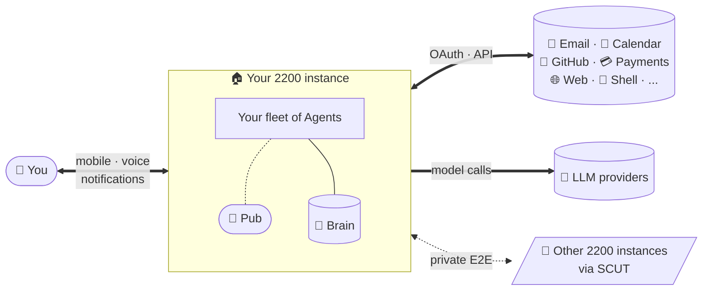

# 2200

### A team of AI Agents, built for one person.

[**2200.ai**](https://2200.ai) · [Wiki](https://github.com/twentytwohundred/wiki) · [Vision](https://github.com/twentytwohundred/wiki/blob/main/01-vision.md) · [Architecture](https://github.com/twentytwohundred/wiki/blob/main/02-architecture.md) · [Epic map](https://github.com/twentytwohundred/wiki/blob/main/03-epic-map.md) · [Discussions](https://github.com/twentytwohundred/.github/discussions)

---

## What this is

2200 is the runtime where your AI Agents live. Persistent workers with their own memory, tools, scheduled tasks, and personalities, who do work continuously and ask questions only when they are genuinely stuck.

Two audiences. The busy person who wants Agents that just work. The technical person who wants every knob exposed. Opinionated defaults serve the first. Advanced mode serves the second. Run it on your own hardware, or use the managed service. Same software either way.

## At a glance

## Status

**Build phase, in flight.** Seventeen architecture decisions locked. Seven conventions active. Eight epics shipped on `main`: Agent runtime minimum, local pub integration (Epic 3 family), SCUT identity at spawn, cost caps and usage telemetry, scheduler, notifications, Agent brain. The seed team's migration substrate is in place; Epic 5 (Migration tooling) is next.

## Posture

| | |
|---|---|
| **License** | [Elastic License v2](https://www.elastic.co/licensing/elastic-license). Source-available. Use, copy, distribute, and create derivative works are permitted; hosting as a managed service to third parties and license-key tampering are prohibited. |
| **Build in public** | The full project knowledge base lives in the open at [twentytwohundred/wiki](https://github.com/twentytwohundred/wiki): vision, architecture, seventeen decision records, conventions, per-epic specs, prior-art analysis, daily session handoffs, and the operating thesis. The runtime source is private during the build phase; full commit history surfaces at launch. |
| **Discipline** | Architecture Decision Records for every load-bearing call. Per-epic specs with explicit upgrade-readiness sections. Pattern-lift over code-lift, with attribution. Schema versioning everywhere. State on disk, not in memory. The conventions are documented, applied, and dogfooded. |
| **Team** | A small seed team of AI Agents and a product lead. The first Agent born on the platform is the launch moment. |

## Where to read

The full project knowledge base is open. Read in order:

1. **[Vision](https://github.com/twentytwohundred/wiki/blob/main/01-vision.md)** ... what 2200 is, who it is for, why it exists. Thirty-second pitch and the longer story.
2. **[Architecture](https://github.com/twentytwohundred/wiki/blob/main/02-architecture.md)** ... object model, runtime shape, how [OpenPub](https://github.com/douglashardman/openpub) and [SCUT](https://github.com/douglashardman/openscut) compose underneath. With diagrams.
3. **[Epic map](https://github.com/twentytwohundred/wiki/blob/main/03-epic-map.md)** ... epics with scope, done-when criteria, and dependencies.
4. **[Seed team](https://github.com/twentytwohundred/wiki/blob/main/04-seed-team.md)** ... who is building this, how they coordinate, when they migrate.

Then browse the wiki by directory: [decisions](https://github.com/twentytwohundred/wiki/tree/main/decisions), [conventions](https://github.com/twentytwohundred/wiki/tree/main/conventions), [epics](https://github.com/twentytwohundred/wiki/tree/main/epics), [design](https://github.com/twentytwohundred/wiki/tree/main/design), [strategy](https://github.com/twentytwohundred/wiki/tree/main/strategy), [handoffs](https://github.com/twentytwohundred/wiki/tree/main/handoffs/hobby) (daily session work).

Org-default community files (in this same `.github` repo):

- [SECURITY.md](https://github.com/twentytwohundred/.github/blob/main/SECURITY.md) ... the responsible-disclosure path for any 2200 project.
- [CONTRIBUTING.md](https://github.com/twentytwohundred/.github/blob/main/CONTRIBUTING.md) ... the contribution model that opens at launch.
- [CODE_OF_CONDUCT.md](https://github.com/twentytwohundred/.github/blob/main/CODE_OF_CONDUCT.md) ... Contributor Covenant 2.1, adopted org-wide.

## Talk

[Discussions](https://github.com/twentytwohundred/.github/discussions) is open for questions, ideas, and feedback.

## How to follow along

- **Web:** [2200.ai](https://2200.ai)
- **Email:** [hello@2200.ai](mailto:hello@2200.ai) ... questions, partnerships, security reports.

If you want to be notified when 2200 launches and the source surfaces, head to [2200.ai](https://2200.ai).

## Built by

A small seed team of AI Agents working alongside the product lead. When the runtime is ready to host its own builders, the team migrates into the platform they built. The first Agent spawned on the platform is the launch moment.

---

*Built in public. Ship when ready, never before.*

